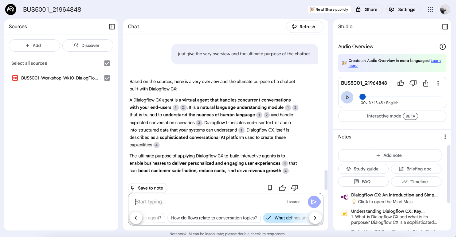

# BUS5001_A3_2196484
# 📘 BUS5001 – Q4: Evaluating NotebookLM as an Educational Assistant

## 🎯 Objective
This evaluation aims to explore the feasibility of integrating **NotebookLM**, Google's AI-powered educational assistant, into a university learning environment. We assess its capabilities using a real workshop PDF from BUS5001 and simulate a student study scenario.

---

## a) 🔍 Key Functionalities for Academic Use

| Feature                | Description                                                                 |
|------------------------|-----------------------------------------------------------------------------|
| 📄 Source-grounded Q&A | Ask questions based on uploaded PDFs with cited answers                     |
| ✍️ Auto Summarisation  | Generate concise summaries of large documents                              |
| 🧠 Mind Map            | Visualise concepts and hierarchy in a document                              |
| 📚 Study Guide / FAQ   | Generate possible exam-style questions or clarifications                   |
| 📅 Timeline Mode       | Track concepts or discussions chronologically                              |
| 🔊 Audio Overview      | Create a voice summary for review or accessibility                         |

---

## b) 🎓 Academic Scenario: Preparing for a BUS5001 Workshop

### 📥 Uploaded Source:
- `BUS5001-Workshop-Wk10-DialogFlowCX.pdf`

### 🔍 Questions Asked:
> Q: What is Dialogflow CX used for?  
> Q: What are entity types in Dialogflow?  
> Q: What are the core differences between flows and intents?

### 📸 Screenshots:
- 
- 

### 🧠 Features Used:
- **Mind Map** to visualise flow → entity → intent structure
- **FAQ Generator** to simulate student revision
- **Citation-supported Q&A** helped verify content accuracy

---

## c) 🧪 Evaluation of AI Capabilities

| Feature         | Accuracy & Relevance | Usefulness in Study | Limitations / Risk |
|----------------|-----------------------|----------------------|---------------------|
| Q&A w/ Citation| ⭐⭐⭐⭐ (contextual, grounded) | Fast revision, deep query | May skip implicit ideas |
| Summary        | ⭐⭐⭐                  | Helps overview        | Can omit details    |
| FAQ Generator  | ⭐⭐⭐⭐                 | Useful for exam prep  | Sometimes too vague |
| Mind Map       | ⭐⭐⭐⭐                 | Visual learner-friendly| Can't edit freely   |
| Audio Overview | ⭐⭐                   | Good for accessibility| Generic language    |

### ⚠️ Bias & Hallucination:
- All answers are grounded in uploaded docs → low hallucination risk.
- Some summaries were generic when PDF formatting was inconsistent.

---

## ✅ Recommendation

NotebookLM is well-suited for:
- Study recap and summary
- Generating student-facing study aids
- Fast document understanding (e.g., course outlines)

### 🚀 Suggestion:
Combine NotebookLM with LMS tools (e.g., Moodle) to enhance self-paced learning. Limit deployment to non-sensitive academic materials (no grades, PII).

---

## 📎 GitHub Repository

All screenshots and notes are logged here:  
**🔗[View all screenshots](https://github.com/Diinmel/BUS5001_A3_21964848/tree/main/screenshots)

